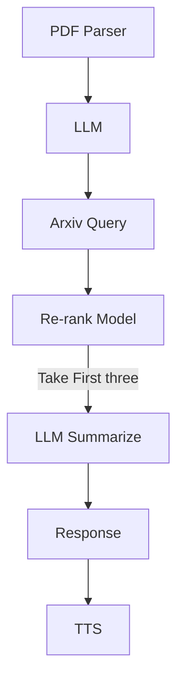

- L'analyseur PDF doit accepter une liste de PDF.
- L'analyseur PDF doit produire une liste de transactions.
- Le catégoriseur d'entreprises attribue une étiquette à chaque transaction.
- Le catégoriseur d'entreprises retourne une liste de transactions avec étiquette.
- L'utilisateur doit vérifier le résultat.
- L'utilisateur accepte le résultat.
- Le système enregistre les transactions dans la base de données.



```