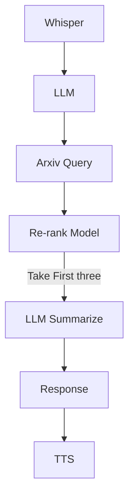

The goal of the [ai-research-assistant](https://github.com/clock1998/ai-research-assistant) to make the experience of searching academic papers more human like, more like a human conversation. The project contains a API and also an web UI. I used Hugging Face for all the AI pipelines. 

The UI is powered by gradio. The API is powered by FastAPI. The Web UI includes a chat window and both text and audio input and output. On a high level, the system works like this: when a user send a voice chat, Whisper will process the voice message to text. The The LLM will take the text and convert it to a Arxiv search query. The LLM will also execute the search query. The system will take the first 50 search result and send to a re-ranking model, because the search query is very basic keyword search. The model will calculate a relevance score based on the original user question and summary of each query results. The system will sort the search result based on the relevance score in a descending order. The system will then take the first three articles and summarize them again to output a shorter version of the summary along with the article link. The final output is also sent to a TTS engine. I used gTTS here. Lastly, the AI assistant will upload the response to Notion using the notion integration API.


## Future Work

I have two plans for the project. I am thinking about making the AI assistant to a MCP. This will increase the usability and accessibility of the AI assistant. Another plan is to make an agent. This could further improve the performance of the AI assistant as it will self prompt to find the most relevance papers. 

## Issues

I noticed that the open source LLM, Llama-3.1-8B-Instruct, in this case, does not always generate the perfect JSON format data. There are several potential solutions according to my research. The easiest one is to use a commercial model which will include a parameter to set the wanted output format. Then, I could also implement a fallback function, so when the format is not correct, the fallback function will simply redo the prompt. Lastly, there are tools that could restrict the output like [Outlines](https://github.com/dottxt-ai/outlines).

## Interesting code snippets  

### System prompt of the search query builder
```python
    SYSTEM_PROMPT = """
    You are a search query engineer. Your goal is to transform a user's research question into a precise arXiv API query string.
    Rules:
    Use field prefixes: ti: (title), au: (author), abs: (abstract), cat: (category).
    Use Boolean operators: AND, OR, ANDNOT (must be capitalized).
    Group terms using parentheses.
    If the user mentions a specific field (e.g., "find papers by Hinton"), use au:.
    If a user is looking for a specific concept, you should use Title(ti:) or Abstract(abs:).
    Query Expansion: Include synonyms (e.g., "LLM" OR "Large Language Model").
    [FUNCTION_SCHEMA]
    {"function": "search_arxiv", "arguments": {"query": "string"}}
    [EXAMPLES]
    User: "Search for quantum computing."
    Assistant: {"function": "search_arxiv", "arguments": {"query": "all:quantum AND all:computing"}}
    User: "Find papers by Einstein."
    Assistant: {"function": "search_arxiv", "arguments": {"query": "au:Einstein"}}
    """
```

### Function calling using LLM

```python
def _route_llm_output(self, llm_output: str) -> str:
        """
        Route LLM response to the correct tool if it's a function call, else return the text.
        Expects LLM output in JSON format like {"function": "...", "arguments": {...}}.
        """
        # Try to parse the entire output as JSON directly
        try:
            output = json.loads(llm_output.strip())
        except json.JSONDecodeError:
            # If that fails, try to extract JSON object from the text
            json_match = re.search(r'\{[^{}]*"function"[^{}]*\}', llm_output)
            if json_match:
                try:
                    output = json.loads(json_match.group())
                except json.JSONDecodeError:
                    # Not a JSON function call; return the text directly
                    return llm_output
            else:
                # Not a JSON function call; return the text directly
                return llm_output

        # Extract function name and arguments
        func_name = output.get("function")
        args = output.get("arguments", {})

        if not func_name:
            # Invalid JSON structure; return the text directly
            return llm_output

        if func_name == "none":
            # No function call needed; return empty or default response
            return ""
        elif func_name == "search_arxiv":
            query = args.get("query", "")
            return self._search_arxiv(query)
        else:
            return f"Error: Unknown function '{func_name}'"
```

### Re-ranker

```python
from sentence_transformers import CrossEncoder

model = CrossEncoder('BAAI/bge-reranker-v2-m3', device='cuda')

def rerank_crossencoder(question: str, candidates: list[str]) -> list[float]:
    """
    Given a question and a list of candidate strings, return CrossEncoder relevance scores.
    Args:
        question (str): The input question.
        candidates (list of str): List of candidate answer strings.
    Returns:
        list of float: Scores for each candidate, in order.
    """
    pairs = [(question, candidate) for candidate in candidates]
    scores = model.predict(pairs)
    return scores
```