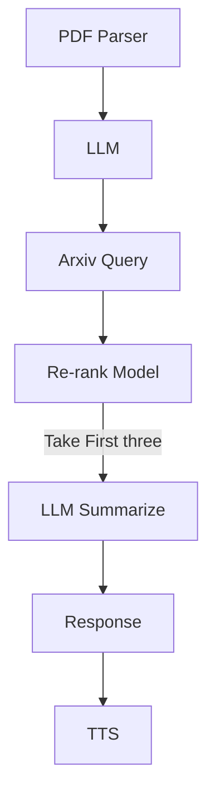

- PDF parser should take a list of PDFs.
- PDF parser should output a list of transactions.
- Business categorizer labels each transaction
- Business categorizer returns a list of transactions with label
- User should verify the output
- User accept output
- System saves transactions in database.

